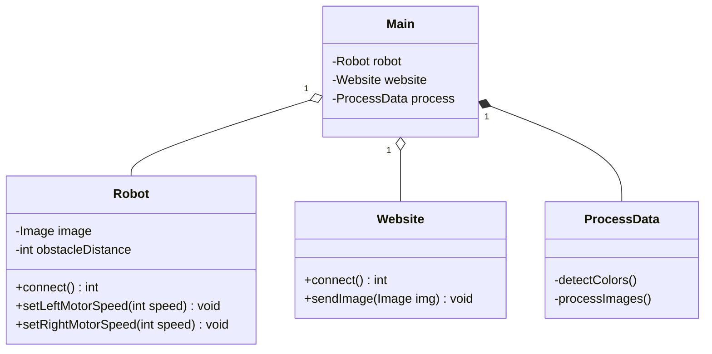

```mermaid
classDiagram
    Main "1" o-- Robot
    Main "1" o-- Website
    Main "1" *-- ProcessData

    class Main {
        -Robot robot
        -Website website
        -ProcessData process
    }
    class Robot {
        -Image image
        -int obstacleDistance
        +connect() int
        +setLeftMotorSpeed(int speed) void
        +setRightMotorSpeed(int speed) void
    }
    class Website {
        +connect() int
        +sendImage(Image img) void
    }
    class ProcessData {
        -detectColors()
        -processImages()
    }
```