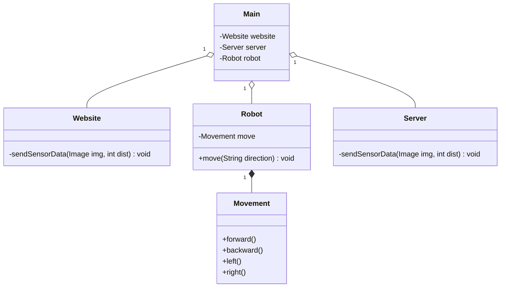

```mermaid
classDiagram
    Main "1" o-- Website
    Main "1" o-- Robot
    Main "1" o-- Server
    Robot "1" *-- Movement
    
    class Main {
        -Website website
        -Server server
        -Robot robot
    }
    class Website {
        -sendSensorData(Image img, int dist) void
    }
    class Server {
        -sendSensorData(Image img, int dist) void
    }
    class Robot {
        -Movement move
        +move(String direction) void
    }
    class Movement {
        +forward()
        +backward()
        +left()
        +right()
    }
```