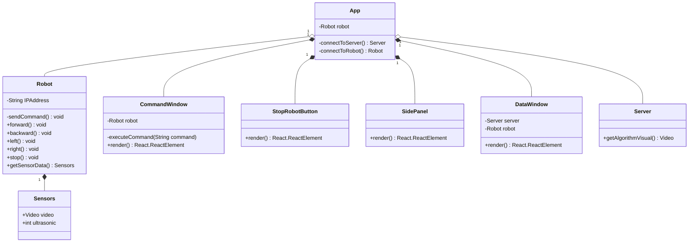

```mermaid
classDiagram

    App "1" o-- Robot
    App "1" *-- CommandWindow
    App "1" *-- StopRobotButton
    App "1" *-- SidePanel
    App "1" *-- DataWindow
    App "1" o-- Server
    Robot "1" *-- Sensors

    class App {
        -Robot robot
        -connectToServer() Server
        -connectToRobot() Robot
    }
    class CommandWindow {
        -Robot robot
        -executeCommand(String command)
        +render() React.ReactElement
    }
    class DataWindow {
        -Server server
        -Robot robot
        +render() React.ReactElement
    }
    class StopRobotButton {
        +render() React.ReactElement
    }
    class SidePanel {
        +render() React.ReactElement
    }
    class Robot {
        -String IPAddress
        -sendCommand() void
        +forward() void
        +backward() void
        +left() void
        +right() void
        +stop() void
        +getSensorData() Sensors
    }
    class Sensors {
        +Video video
        +int ultrasonic
    }
    class Server {
        +getAlgorithmVisual() Video
    }
```