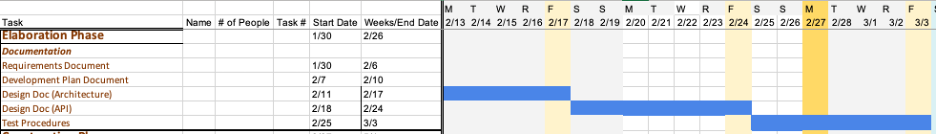
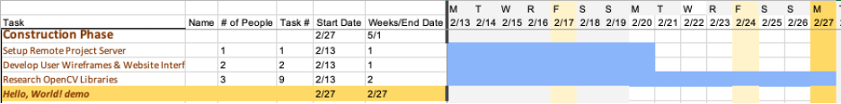
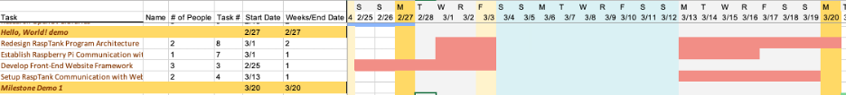
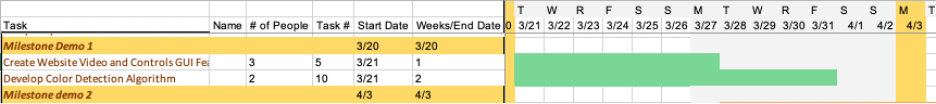
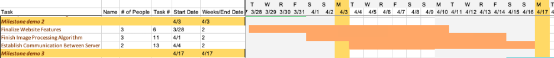
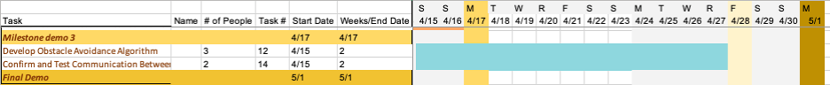
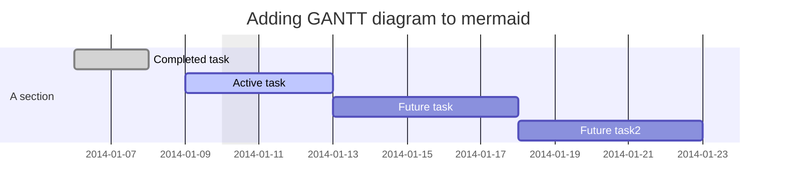

# Schedule
The schedule was split into sections based on the different milestones of the project. Each milestone pairs with tasks that should be completed before presenting. The elaboration phase is the phase dedicated to documentation of the project. The Hello World demo contains the tasks which must be completed to show a proof of concept for the overall project design. The first milestone begins tasks which build off the previous tasks. From here, each further milestone demonstration will build off the previous until the Final Deme, where the project should be finished days ahead of time for final testing and preparation. 

## Elaboration Phase

## Hello World Demo

## Milestone Demo 1

## Milestone Demo 2

## Milestone Demo 3

## Final Demo

## Mermaid Gantt Chart

