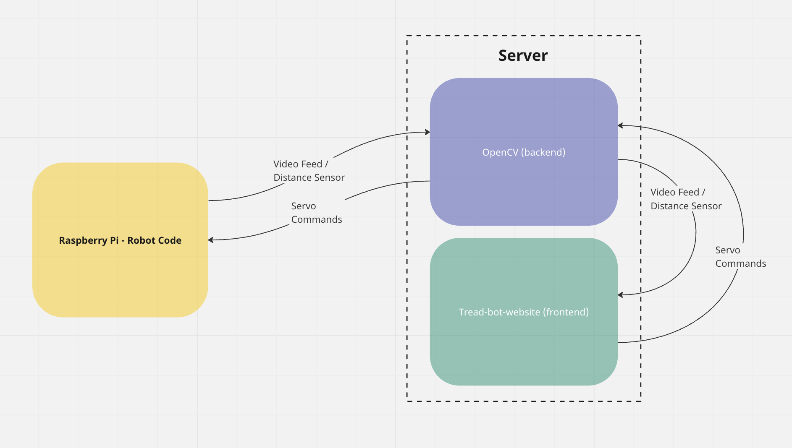

# System Block Diagram
## Raspberry Pi Peripherals
<!-- TODO: New input for server commands and output for autonomous data -->

<em>Figure 1: Raspberry Pi communication with peripherals</em>

The design diagram of RoboControl Robot's external components are shown in Figure 1. The Raspberry Pi acts as the mechanical controller for the system, managing the connections to other components and peripherals. It is connected to geared motors, which are connected to tank treads, providing the robot with mobility and tankdrive. The Raspberry Pi is also connected to the five servos, which are responsible for providing precise control over the position and movement of the robotic arm. The servos receive a control signal from the Raspberry Pi, specifying the direction to power the specified servo, and then move the robot arm in that direction for precise control. 

The Raspberry Pi also connects to a camera module and an ultrasonic distance sensor module, which enable the robot to gather information about its environment. The camera module allows the robot to capture visual data and process it for various tasks, while the ultrasonic sensor module provides information about distances and obstacles in the robot's surroundings. The Raspberry Pi also connects to a power supply, which provides the necessary power for the components to function.

To communicate with the website, the Raspberry Pi sends and receives JSON messages from the server. The sent messages will contain the images which will be used for processing and the ultrasonic distances. The received messages will contain commands expected to be executed by the Raspberry Pi, such as turn left, move forwards, open claw, and more.

## System Architecture
<!-- TODO: Replace with updated image. Commands should go back to server. There is no communication between robot and website. Also include the ExpressJS server in updated image -->

<em>Figure 2: Robot, server, website block diagram</em>

<!-- TODO: Update content when image is updated -->
Figure 2 showcases the communication pathway between the Raspberry Pi and the server. The server comprises of the OpenCV python code and a graphical user interface (GUI) website and will be hosted using an Amazon Web Services EC2 instance. These blocks will not be running on the Raspberry Pi to save resources when controlling the motors and servos. The Raspberry Pi acts as the interface between the robot's physical components, including the camera module and ultrasonic sensor module, and the server. It receives environmental data from the camera and ultrasonic modules in the form of images and distances respectively. This data is then transmitted to the OpenCV software for analysis with algorithms. The OpenCV algorithms process the data to determine appropriate motor speeds, which are subsequently sent back to the Raspberry Pi. A visualization of the algorithms being used in the OpenCV code will be sent to the GUI and displayed to the user for more information.

The GUI serves as the primary means of interaction with the robot. The GUI receives two different types of data from the OpenCV code: algorithm images and sensor data. Algorithm images will be useful to the user, as these will be displayed to show what process the server is undertaking to detect a possible path. Sensor data will be used to display the real-time video from the robot as well as whether there are any obstructions visible to the ultrasonic distance sensor or not. The GUI will have input buttons, which should be able to command the robot to perform certain actions such as driving forwards, turning, and more. 

All the data communication and transmission occurring in this diagram will be accomplished through the WebSocket protocol in python and JavaScript. Since the robot code is written in Python and the OpenCV code will also be, the team will utilize Python’s WebSocket library for communication purposes. In the GUI, JavaScript’s WebSocket library will be utilized to communicate between both the OpenCV code and the Raspberry Pi code. 

