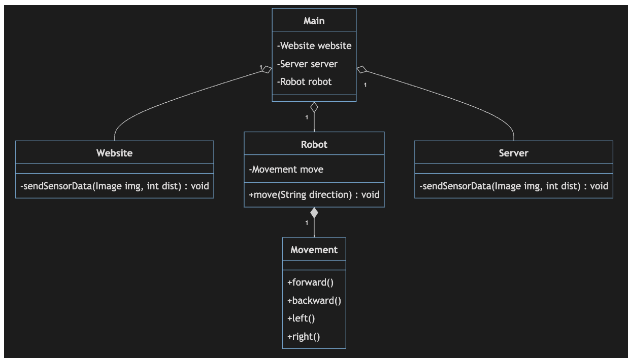
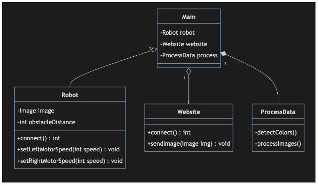
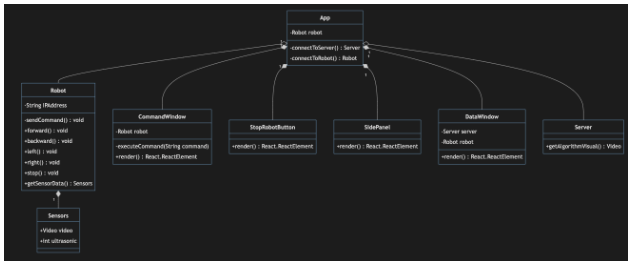

# Class Diagrams

## Robot Diagram ##

### Robot Code ###
* (Main) Class purpose: Creates instances of Website, Server and Robot classes and handles their interactions. 
    * Data Fields:  
        * website 
            * Type: Website 
        * timer: 
            * Type: Timer 
        * robot: 
            * Type: Robot 

* (Website) Class purpose: Provides a means for sending data from the robot to the website. 
    * Data Fields:  
        * img 
            * Type: Image 
        * dist: 
            * Type: int 

    * Methods: 
        * sendSensorData(Image img, int dist): void 
            * This method will send the data acquired by the sensors (camera and ultrasonic) to the website in the form of a JSON string. 
            * Pre-conditions: The robot's camera and ultrasonic sensors must be functioning properly. 
            * Parameters: img, dist 
            * Return Values: None 
            * Exceptions thrown: None  

* (Robot) Class purpose: Facilitates the movement of the robot. 
    * Data Fields: 
        * move 
            * Type: Movement 
    * Methods: 
        * move(String direction): void 
            * This method will accept a string as an argument and send a command to the servos as an output. 
            * Preconditions: The direction must be a string representing a valid direction, which can be one of the following: "forward", "backward", "left", or "right". 
            * Parameters: direction 
            * Return Value: None 
            * Exceptions Thrown: None 

* (Server) Class purpose: Sends robot data to the server. 
    * Methods: 
        * sendSensorData(Image img, int dist): void 
            * This method will send the data acquired by the sensors (camera and ultrasonic) to the server in the form of JSON strings. 
            * Pre-conditions: The robot's camera and ultrasonic sensors must be functioning properly. 
            * Parameters: img, dist 
            * Return Values: None 
            * Exceptions thrown: None 

* (Movement) Class purpose: This class will house the logic for the different movements of the robot. 
    * Methods: 
        * forward() 
            * Moves the robot Forward in its current direction by the current speed. 
            * Parameters: None 
            * Return Value: None 
            * Exceptions Thrown: None 

        * backward() 
            * Moves the robot backward in its current direction by the current speed. 
            * Parameters: None 
            * Return Value: None 
            * Exceptions Thrown: None 

        * left() 
            * Moves Turns the robot left 
            * Parameters: None 
            * Return Value: None 
            * Exceptions Thrown: None 

        * right() 
            * Turns the robot right 
            * Parameters: None 
            * Return Value: None 
            * Exceptions Thrown: None 
            
## OpenCV Diagram ##

### OpenCV Code ###
* (Main) Class Purpose: The controller for navigation and image recognition. It ties together all the subcomponents within the OpenCV architecture allowing for seamless communication and data transfer. 
    * Data Fields: 
        * robot 
            * Type: Robot 
        * website 
            * Type: Website
        * process 
            * Type: ProcessData 

* (Robot) Class purpose: Represents data and information sent to and from the robot itself. The class will also contain methods to manipulate the robot’s speed by left and right tracks. 
    * Data Fields: 
        * image 
            * Type: Image 
        * obstacleDistance 
            * Type: int 
    * Methods: 
        * serve(): int 
            * This method will start the robot WebSocket server.  
            * Parameters: None 
            * Pre-conditions: None 
            * Post-conditions: None 
            * Return Values: 1 for successful connection, 0 otherwise.  
            * Exceptions Thrown:  
                * 404: Robot not available 
                * 405: Left tread motor not working. 
                * 406: Right tread motor not working. 

        * setLeftMotorSpeed(int speed): void
            * This method will set the speed of the left tread motors. It will accept an integer and pass this value to the left tread motors. 
            * Parameters: An integer value for speed.  
            * Pre-conditions: Successful connection to robot 
            * Post-conditions: None 
            * Exceptions Thrown:  
                * 405: Left tread motor not functioning. 
        
        * SetRightMotorSpeed(int speed): void 
            * This method will set the speed of the right tread motors. It will accept an integer and pass this value to the right tread motors.  
            * Parameters: An integer value for speed. 
            * Pre-conditions: Successful connection to robot 
            * Post-conditions: None 
            * Exceptions Thrown:  
                * 406: Right motor not working.  

* (Website) Class purpose: Sends data to the website for display purposes. Used for visualization of the imaging algorithm. 
    * Methods: 
        * serve(): int 
            * This method will start the website WebSocket server. 
            * Parameters: None 
            * Pre-conditions: None 
            * Post-conditions: None 
            * Return Values: 1(one) for successful connection, 0(zero) otherwise.  
            * Exceptions Thrown: 
                * 414: Website not available. 
                * sendImage(Image image): void 
                * This method will transfer image(s) to be displayed on the website.  
                * Parameters: An image received by the robot’s camera. 
                * Pre-conditions: Successful connection(s) to both robot and website. 
                * Post-conditions: None 
                * Exceptions Thrown: 
                    * 415: Image is not of proper resolution. 
* (ProcessData) Class purpose: Processes image(s) received by the robot and detect color(s) for object recognition. 
    * Methods: 
        * detectColors(): void 
            * This method will detect color(s) in images received by the robot.  
            * Parameters: None 
            * Pre-conditions: Successful connection to robot. 
            * Post-conditions: None 
            * Return values: None 
            * Exceptions Thrown: 
                * 424: No image(s) to process. 
                * 425: Image is grey scaled. 

        * processImages(): void 
            * This method converts information from the images and ultrasonic distances to motor speeds. 
            * Parameters: None 
            * Pre-conditions: Successful connection to robot 
            * Post-conditions: None 
            * Return values: None 
            * Exceptions Thrown: 
                * 434: No image received. 
                * 435: Unknown value(s) in image. 

## Website Diagram ##

### Website Code ###
* (Robot) Class purpose: To control the robot's movements and retrieve sensor data. 
    * Data Fields:
        * IPAddress 
            * Type: string 
    
    * Methods:  
        * sendCommand(string command): void 
            * Sends specified command to the robot in JSON format. 
            * Pre-Conditions: The robot must be connected to the website and functioning properly. 
            * Post-Conditions: None 
            * Parameters:  
                * command: A string command that will be sent to the robot. 
            * Returns: None 
        
        * forward(): void 
            * Sends forward command to the robot. 
            * Pre-Conditions: The robot must be connected and functioning        properly. 
            * Post-Conditions: None 
            * Parameters: None 
            * Returns: None 

        * backward(): void 
            * Sends backward command to the robot. 
            * Pre-Conditions: The robot must be connected and functioning properly. 
            * Post-Conditions: None 
            * Parameters: None 
            * Returns: None 

        * left(): void 
            * Sends left command to the robot. 
            * Pre-Conditions: The robot must be connected and functioning properly. 
            * Post-Conditions: None 
            * Parameters: None 
            * Returns: None 

        * right(): void 
            * Sends right command to the robot. 
            * Pre-Conditions: The robot must be connected and functioning properly. 
            * Parameters: None 
            * Returns: None 

        * stop(): void 
            * Sends stop command to the robot. 
            * Pre-Conditions: The robot must be connected and functioning properly. 
            * Post-Conditions: None 
            * Parameters: None 
            * Returns: None 

        * getSensorData(): Sensors 
            * Retrieves sensor data from the robot. 
            * Pre-Conditions: The robot must be connected and functioning properly. 
            * Post-Conditions: None 
            * Parameters: None 
            * Returns: A Sensors object representing the sensor data 

* (Sensors) Class purpose: Data type for storing sensor data from the robot (video, ultraonsic). 
    * Data Fields:  
        * image 
            * Type: Image 
        * ultrasonic 
            * Type: int 

* (CommandWindow) Class purpose: To execute commands on the robot and render a user interface element. 
    * Data Fields:  
        * robot 
            * Type: Robot 

    * Methods:  
        * executeCommand(String command): void 
            * Executes a command given as a string. 
            * Pre-Conditions: The robot must be initialized and connected. 
            * Post-Conditions: None 
            * Parameters: command (String) - the command to be executed 
            * Returns: None 
            * Exceptions thrown: None 

        * render(): React.ReactElement 
            * Renders the command window component. 
            * Pre-Conditions: None 
            * Post-Conditions: None 
            * Parameters: None 
            * Returns: A React.ReactElement 
            * Exceptions thrown: None 

* (StopRobotButton) Class purpose: To render a user interface element to stop the robot's movement. 
    * Methods:  
        * render(): React.ReactElement 
            * Renders the stop button component. 
            * Pre-Conditions: None 
            * Post-Conditions: None 
            * Parameters: None 
            * Returns: A React.ReactElement 
            * Exceptions thrown: None 

* (SidePanel) Class purpose: To render a selection panel on the side of the website for navigation. 
    * Methods:  
        * render(): React.ReactElement 
            * Renders the side panel component. 
            * Pre-Conditions: None 
            * Post-Conditions: None 
            * Parameters: None 
            * Returns: A React.ReactElement 
            * Exceptions thrown: None 

* (DataWindow) Class purpose: To retrieve and display server and robot data and render a user interface element. 
    * Data Fields:  
        * server 
            * Type: Server 
        * robot 
            * Type: Robot 

    * Methods:  
        * render(): React.ReactElement 
            * Renders the data window component. 
            * Pre-Conditions: The server and robot must be initialized and connected. 
            * Post-Conditions: None 
            * Parameters: None 
            * Returns: A React.ReactElement 
            * Exceptions thrown: None 

* (Server) Class purpose: Send messages to and communicate with the OpenCV code on the server. 
    * Methods:  
        * getAlgorithmVisual(): Image 
            * Returns a video that shows the algorithm being used by the server. 
            * Pre-Conditions: None 
            * Post-Conditions: None 
            * Parameters: None 
            * Returns: A Video object 
            * Exceptions thrown: None 

* (App) Class purpose: To connect the user to the server and the robot. 
    * Data Fields:  
        * robot 
            * Type: Robot 

    * Methods:  
        * connectToServer(): Server 
            * Connects the app to the server. 
            * Pre-Conditions: The server must be initialized and the WebSocket server running. 
            * Post-Conditions: None 
            * Parameters: None 
            * Returns: A Server object 
            * Exceptions thrown: None 
        * connectToRobot(): Robot  
            * Connects the app to the robot. 
            * Pre-Conditions: The robot must be initialized and the robot WebSocket server running. 
            * Post-Conditions: None 
            * Parameters: None 
            * Returns: A Robot object 
            * Exceptions thrown: None \

# Sequence Diagrams
<!-- TODO: Insert sequence diagram stuff -->