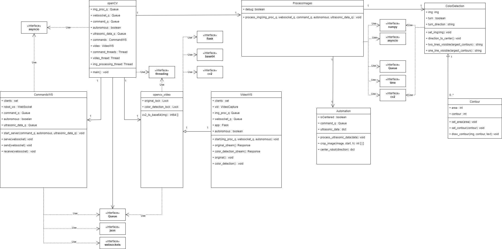

# Class Diagrams

## Robot Diagram ##

### Robot Code ###
* (Main) Class purpose: Main handler of robot functions. Also manages the websockets for sending data.
    * Data Fields:  
        * commands: 
            * Type: RobotCommandsWS 
        * video: 
            * Type: RobotVideoWS 
        * commands_thread: 
            * Type: Thread 
        * video_thread:
            * Type: Thread

* (robot_commands_ws) Class purpose: Provides a means for sending commands from the robot to the server. 
    * Data Fields:  
        * PORT 
            * Type: int 
        * HOST: 
            * Type: string 
        * HOST_PATH:
            * Type: string
        * fuc : 
            * Type: functions
        * clients: 
            * Type: Set
        * robot_ws: 
            * Type: WebSocket
        * autonomous:
            * Type: boolean
        * connected:
            * Type: boolean

    * Methods: 
        * connect(): void 
            * This method will connect the robot to the server through JSON websockets. 
            * Pre-conditions: None
            * Parameters: None 
            * Return Values: None 
            * Exceptions thrown: None 
        * receive(WebSocket): void 
            * This method will interpret commands received through the JSON websockets. 
            * Pre-conditions: None
            * Parameters: Websocket 
            * Return Values: None 
            * Exceptions thrown: None  
        * send(WebSocket): void 
            * This method will send data from the robot to the server through JSON websockets. 
            * Pre-conditions: None
            * Parameters: WebSocket 
            * Return Values: None 
            * Exceptions thrown: None 

* (RobotVideoWS) Class purpose: Send video data from the robot to the server. 
    * Data Fields: 
        * gstr 
            * Type: string 
    * Methods: 
        * run(): void 
            * This method take the images from the robot's onboard camera and send it through the JSON websocket. 
            * Preconditions: None 
            * Parameters: None 
            * Return Value: None 
            * Exceptions Thrown: None 
## OpenCV Diagram ##

### OpenCV Code ###
* (opencv) Class Purpose: The controller for video feed display and image processing. Also handles command passing to the robot for both manual and autnomous mode. 
    * Data Fields: 
        * img_proc_q 
            * Type: Queue 
        * websocket_q 
            * Type: Queue
        * command_q: 
            * Type: Queue 
        * autonomous:
            * Type: boolean
        * ultrasonic_data_q:
            * Type: Queue
        * commands:
            * Type: CommandWS
        * video:
            * Type: VideoWS
        * commands_thread:
            * Type: Thread
        * video_thread:
            * Type: Thread
        * img_processing_thread:
            * Type: Thread

* (opencv_video) Class purpose: Handles the processing and passing of video images.  
    * Data Fields: 
        * original_lock 
            * Type: Lock 
        * color_detection_lock 
            * Type: Lock 
    * Methods: 
        * cv2_to_base64(img): int64 []
            * This method will take the image from the video feed and convert it to base64 array.  
            * Parameters: Image 
            * Pre-conditions: Must be connected to the robot websocket delivering images from the onboard camera 
            * Post-conditions: None 
            * Return Values: An array of base64 integers 
            * Exceptions Thrown: None
       
* (VideoWS) Class purpose: Connects to the websocket port and creates two video feeds, one of the original video data and one of the processed images from the onboard camera. 
    * Methods: 
        * start(img_proc_q, websocket_q, autonomous): void 
            * This method connects to the websocket queue for both the image processing and display of original video 
            * Parameters: img_proc_q, websocket_q, autonomous 
            * Pre-conditions: Connection to both website and robot 
            * Post-conditions: None 
            * Return Values: None  
            * Exceptions Thrown: None
 
* (CommandsWS) Class purpose: Handles the sending of commands through either manual or autonomous mode.
    * Data Fields:
        * PORT:
            * Type: int
        * HOST:
            * Type: string 
    * Methods: 
        * start_server(): void 
            * This method start the connection to the robot for passing of commands.  
            * Parameters: None 
            * Pre-conditions: Successful connection to robot and website host. 
            * Post-conditions: None 
            * Return values: None 
            * Exceptions Thrown: None 

        * serve(websocket): void 
            * This method sends data and receives commands from the website. 
            * Parameters: Websocket 
            * Pre-conditions: Successful connection to robot and the website host.
            * Post-conditions: None 
            * Return values: None 
            * Exceptions Thrown: None

        * receive(websocket): void
            * This method will receive commands from the website as well as flag to set the autonomous function.
            * Parameters: Websocket
            * Pre-conditions: Successful connections to the robot and the website host.
            * Post-conditions: None
            * Return values: None
            * Excpetions Thrown: None

## Website Diagram ##

### Website Code ###
* (Robot) Class purpose: To control the robot's movements and retrieve sensor data. 
    * Data Fields:
        * IPAddress 
            * Type: string 
    
    * Methods:  
        * sendCommand(string command): void 
            * Sends specified command to the robot in JSON format. 
            * Pre-Conditions: The robot must be connected to the website and functioning properly. 
            * Post-Conditions: None 
            * Parameters:  
                * command: A string command that will be sent to the robot. 
            * Returns: None 
        
        * forward(): void 
            * Sends forward command to the robot. 
            * Pre-Conditions: The robot must be connected and functioning        properly. 
            * Post-Conditions: None 
            * Parameters: None 
            * Returns: None 

        * backward(): void 
            * Sends backward command to the robot. 
            * Pre-Conditions: The robot must be connected and functioning properly. 
            * Post-Conditions: None 
            * Parameters: None 
            * Returns: None 

        * left(): void 
            * Sends left command to the robot. 
            * Pre-Conditions: The robot must be connected and functioning properly. 
            * Post-Conditions: None 
            * Parameters: None 
            * Returns: None 

        * right(): void 
            * Sends right command to the robot. 
            * Pre-Conditions: The robot must be connected and functioning properly. 
            * Parameters: None 
            * Returns: None 

        * stop(): void 
            * Sends stop command to the robot. 
            * Pre-Conditions: The robot must be connected and functioning properly. 
            * Post-Conditions: None 
            * Parameters: None 
            * Returns: None 

        * getSensorData(): Sensors 
            * Retrieves sensor data from the robot. 
            * Pre-Conditions: The robot must be connected and functioning properly. 
            * Post-Conditions: None 
            * Parameters: None 
            * Returns: A Sensors object representing the sensor data 

* (Sensors) Class purpose: Data type for storing sensor data from the robot (video, ultraonsic). 
    * Data Fields:  
        * image 
            * Type: Image 
        * ultrasonic 
            * Type: int 

* (CommandWindow) Class purpose: To execute commands on the robot and render a user interface element. 
    * Data Fields:  
        * robot 
            * Type: Robot 

    * Methods:  
        * executeCommand(String command): void 
            * Executes a command given as a string. 
            * Pre-Conditions: The robot must be initialized and connected. 
            * Post-Conditions: None 
            * Parameters: command (String) - the command to be executed 
            * Returns: None 
            * Exceptions thrown: None 

        * render(): React.ReactElement 
            * Renders the command window component. 
            * Pre-Conditions: None 
            * Post-Conditions: None 
            * Parameters: None 
            * Returns: A React.ReactElement 
            * Exceptions thrown: None 

* (StopRobotButton) Class purpose: To render a user interface element to stop the robot's movement. 
    * Methods:  
        * render(): React.ReactElement 
            * Renders the stop button component. 
            * Pre-Conditions: None 
            * Post-Conditions: None 
            * Parameters: None 
            * Returns: A React.ReactElement 
            * Exceptions thrown: None 

* (SidePanel) Class purpose: To render a selection panel on the side of the website for navigation. 
    * Methods:  
        * render(): React.ReactElement 
            * Renders the side panel component. 
            * Pre-Conditions: None 
            * Post-Conditions: None 
            * Parameters: None 
            * Returns: A React.ReactElement 
            * Exceptions thrown: None 

* (DataWindow) Class purpose: To retrieve and display server and robot data and render a user interface element. 
    * Data Fields:  
        * server 
            * Type: Server 
        * robot 
            * Type: Robot 

    * Methods:  
        * render(): React.ReactElement 
            * Renders the data window component. 
            * Pre-Conditions: The server and robot must be initialized and connected. 
            * Post-Conditions: None 
            * Parameters: None 
            * Returns: A React.ReactElement 
            * Exceptions thrown: None 

* (Server) Class purpose: Send messages to and communicate with the OpenCV code on the server. 
    * Methods:  
        * getAlgorithmVisual(): Image 
            * Returns a video that shows the algorithm being used by the server. 
            * Pre-Conditions: None 
            * Post-Conditions: None 
            * Parameters: None 
            * Returns: A Video object 
            * Exceptions thrown: None 

* (App) Class purpose: To connect the user to the server and the robot. 
    * Data Fields:  
        * robot 
            * Type: Robot 

    * Methods:  
        * connectToServer(): Server 
            * Connects the app to the server. 
            * Pre-Conditions: The server must be initialized and the WebSocket server running. 
            * Post-Conditions: None 
            * Parameters: None 
            * Returns: A Server object 
            * Exceptions thrown: None 
        * connectToRobot(): Robot  
            * Connects the app to the robot. 
            * Pre-Conditions: The robot must be initialized and the robot WebSocket server running. 
            * Post-Conditions: None 
            * Parameters: None 
            * Returns: A Robot object 
            * Exceptions thrown: None \

# Sequence Diagrams
<!-- TODO: Insert sequence diagram stuff -->