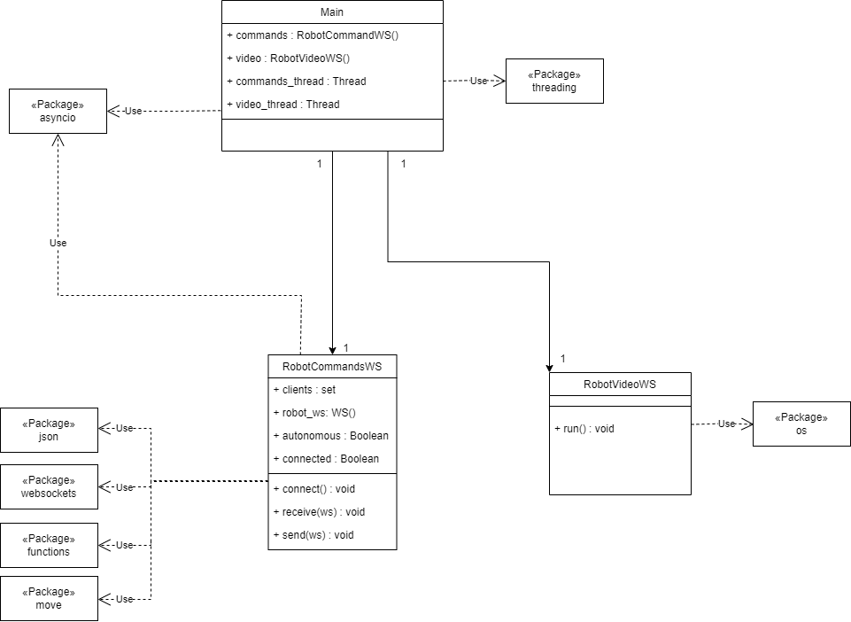

# Class Diagrams

## Robot Diagram ##

### Robot Code ###
* (Main) Class purpose: Main handler of robot functions. Also manages the websockets for sending data.
    * Data Fields:  
        * commands: 
            * Type: RobotCommandsWS 
        * video: 
            * Type: RobotVideoWS 
        * commands_thread: 
            * Type: Thread 
        * video_thread:
            * Type: Thread

* (robot_commands_ws) Class purpose: Provides a means for sending commands from the robot to the server. 
    * Data Fields:  
        * PORT 
            * Type: int 
        * HOST: 
            * Type: string 
        * HOST_PATH:
            * Type: string
        * fuc : 
            * Type: functions
        * clients: 
            * Type: Set
        * robot_ws: 
            * Type: WebSocket
        * autonomous:
            * Type: boolean
        * connected:
            * Type: boolean

    * Methods: 
        * connect() : void 
            * This method will connect the robot to the server through JSON websockets. 
            * Pre-conditions: None
            * Parameters: None 
            * Return Values: None 
            * Exceptions thrown: None 
        * receive(WebSocket) : void 
            * This method will interpret commands received through the JSON websockets. 
            * Pre-conditions: None
            * Parameters: 
                * Websocket: A JSON websocket connecting the the host server. 
            * Return Values: None 
            * Exceptions thrown: None  
        * send(WebSocket) : void 
            * This method will send data from the robot to the server through JSON websockets. 
            * Pre-conditions: None
            * Parameters: 
                * WebSocket: A JSON websocket connecting the the host server. 
            * Return Values: None 
            * Exceptions thrown: None 

* (RobotVideoWS) Class purpose: Send video data from the robot to the server. 
    * Data Fields: 
        * gstr 
            * Type: string 
    * Methods: 
        * run() : void 
            * This method take the images from the robot's onboard camera and send it through the JSON websocket. 
            * Preconditions: None 
            * Parameters: None 
            * Return Value: None 
            * Exceptions Thrown: None 
## OpenCV Diagram ##

### OpenCV Code ###
* (opencv) Class Purpose: The controller for video feed display and image processing. Also handles command passing to the robot for both manual and autnomous mode. 
    * Data Fields: 
        * img_proc_q 
            * Type: Queue 
        * websocket_q 
            * Type: Queue
        * command_q: 
            * Type: Queue 
        * autonomous:
            * Type: boolean
        * ultrasonic_data_q:
            * Type: Queue
        * commands:
            * Type: CommandWS
        * video:
            * Type: VideoWS
        * commands_thread:
            * Type: Thread
        * video_thread:
            * Type: Thread
        * img_processing_thread:
            * Type: Thread

* (opencv_video) Class purpose: Handles the processing and passing of video images.  
    * Data Fields: 
        * original_lock 
            * Type: Lock 
        * color_detection_lock 
            * Type: Lock 
    * Methods: 
        * cv2_to_base64(img) : int64 []
            * This method will take the image from the video feed and convert it to base64 array.  
            * Parameters: 
                * img: An image received received from the robot in cv2 format. 
            * Pre-conditions: Must be connected to the robot websocket delivering images from the onboard camera 
            * Post-conditions: None 
            * Return Values: An array of base64 integers 
            * Exceptions Thrown: None
       
* (VideoWS) Class purpose: Connects to the websocket port and creates two video feeds, one of the original video data and one of the processed images from the onboard camera. 
    * Data Fields: 
        * None
    * Methods: 
        * start(img_proc_q, websocket_q, autonomous) : void 
            * This method connects to the websocket queue for both the image processing and display of original video 
            * Parameters: 
                * img_proc_q: A queue of processed images to send to the website.
                * websocket_q: A queue of images received from the robot.
                * autonomous: A boolean value to indicate whether or not the autonomous logic should be executed. 
            * Pre-conditions: Connection to both website and robot 
            * Post-conditions: None 
            * Return Values: None  
            * Exceptions Thrown: None
 
* (CommandsWS) Class purpose: Handles the sending of commands through either manual or autonomous mode.
    * Data Fields:
        * PORT:
            * Type: int
        * HOST:
            * Type: string 
    * Methods: 
        * start_server(): void 
            * This method start the connection to the robot for passing of commands.  
            * Parameters: None 
            * Pre-conditions: Successful connection to robot and website host. 
            * Post-conditions: None 
            * Return values: None 
            * Exceptions Thrown: None 

        * serve(websocket): void 
            * This method sends data and receives commands from the website. 
            * Parameters: 
                * Websocket: A JSON websocket. 
            * Pre-conditions: Successful connection to robot and the website host.
            * Post-conditions: None 
            * Return values: None 
            * Exceptions Thrown: None

        * receive(websocket): void
            * This method will receive commands from the website as well as flag to set the autonomous function.
            * Parameters: 
                * Websocket: A JSON websocket.
            * Pre-conditions: Successful connections to the robot and the website host.
            * Post-conditions: None
            * Return values: None
            * Exceptions Thrown: None

* (process_images) Class purpose: Processes the images received from the robot.
    * Data Fields:
        * None
    * Methods:
        * process_img(img_proc_q, websocket_q, command_q, autonomous, ultrasonic_data_q) : void
            * This method processes the images received. If in manual mode, sends commands from website to robot. If in autonomous mode, executes the logic to send commands to the robot.
            * Parameters: 
                * img_proc_q: A queue of processed images received to send to the website.
                * websocket_q: A queue of images received from the robot.
                * command_q: A queue of commands to send to the robot. All commands are in dict format.
                * autonomous: A list of a single boolean value.
                * ultrasonic_data_q: A queue of ultrasonic data received from the robot in dict format. 
            * Pre-conditions: None
            * Post-conditions: None
            * Return values: None
            * Exceptions Thrown: None

* (automation) Class purpose: The automation logic to execute to the robot.
    * Data Fields:
        * isCentered: 
            * Type: boolean
        * commands_q:
            * Type: Queue
        * ultrasonic_data:
            * Type: dict
    * Methods:
        * process_ultrasonic_data(data) : void
            * This method processes individual ultrasonic data packets pulled from the ultrasonic data queue. 
            * Parameters:
                * data: The data received from the robot. This will be a dict item.
            * Pre-conditions: None
            * Post-conditions: None
            * Return values: None
            * Exceptions Thrown: None
        * crop_image(image, start, h) : int [] []
            * This method crops the image received from the robot onboard camera.
            * Parameters:
                * image: The image received from the robot. This is pulled from the websocket queue.
                * start: An integer value depicting the index of the image in array form. 
                * h: An integer value representing the height of the image to be cut.
            * Pre-conditions: None
            * Post-conditions: None
            * Return values: An integer array holding X and Y pixel matrix of the image.
            * Exceptions Thrown: None
        * center_robot(direction) : dict
            * This method returns a dictionary item of the specific direction to turn the robot.
            * Parameters: 
                * direction: A string value of which way to turn the robot.
            * Pre-conditions: None
            * Post-conditions: None
            * Return values: A dictionary item holding the direction, turn, and speed values to turn the robot. 
            * Exceptions Thrown: None

* (color_detection) Class purpose: Identifies the color to search for in the image and creates contours around those objects.
    * Data Fields: 
        * yellow_tape_lower: 
            * Type: A numpy array of integer values with the RGB values of the lower end for the color to detect.
        * yellow_tape_upper:
            * Type: A numpy array of integer values iwth the RGB values of the upper end for hte color to detect.
        * kernel: 
            * Type: A numpy matrix of 1's.
        * center_tolerance: 
            * Type: An integer value of the tolerance for centering.
        * contour_tolerance:
            * Type: An integer value of the tolerance for contour size.
    * Methods:
        * None

* (Contour) Class purpose: An object over the image received from the robot depicting the area of the color defined.
    * Data Fields:
        * area:
            * Type: An integer value of the area to select.
        * contour:
            * Type: A contour of the detected value.
    * Methods:
        * draw_contour(img, contour, text) : void
            * This method draws the contour over the image received from the robot image queue.
            * Parameters:
                * img: The image in cv2 format received from the robot image queue.
                * contour: The contour object to put over the image.
                * text: A string value to put next to the contour placed over the image.
            * Pre-conditions: None
            * Post-conditions: None
            * Return values: None
            * Exceptions Thrown: None

* (ColorDetection) Class purpose: Detects the color between the selected range defined in the color_detection class.
    * Data Fields:
        * img:
            * Type: Image
        * turn:
            * Type: boolean
        * turn_direction:
            * Type: string
    * Methods:
        * set_img(img) : void
            * This methods sets the image for color detection.
            * Parameters:
                * img: An image received from the robot onboard camera.
            * Pre-conditions: None
            * Post-conditions: None
            * Return values: None
            * Exceptions Thrown: None
        * direction to center(): string
            * This methods returns a dictionary item that hold the values to center the robot. If there is two contours, calls two_lines visible method. If only a single contour, calls one_line_visible method. If no contours, sends backward command.
            * Parameters: None
            * Pre-conditions: None
            * Post-conditions: None
            * Return values: A dictionary item holding the direction, turn, and speed values to the center between two contours or a single contour.
            * Exceptions Thrown: None
        * two_lines_visible(largest_contours) : string
            * This method decides if the robot is centerd between two detected contours.
            * Parameters: 
                * largest_contours: A list of the largest contours detected from the image of the color specified in color_detection.
            * Pre-conditions: Two contours detected within the image.
            * Post-conditions: None
            * Return value: A string of 'left', 'right', 'forward', or 'backward'.
            * Exceptions Thrown: None
        * one_line_visible(largest_contours) : String
            * This method returns a string object to center the robot. A single contour is only possible of the robot needs to make a turn.
            * Parameters: 
                * largest_contours: A list of the largest contours detected from the image of the color specified in color_detection.
            * Pre-conditions: Only one contour detected within the image.
            * Post-conditions: Turn the robot to bring back two contours into the image.
            * Return value: A string of 'left', 'right', 'forward', or 'backward'.
            * Exceptions Thrown: None

## Website Diagram ##

### Website Code ###
* (Robot) Class purpose: To control the robot's movements and retrieve sensor data. 
    * Data Fields:
        * IPAddress 
            * Type: string 
    
    * Methods:  
        * sendCommand(string command): void 
            * Sends specified command to the robot in JSON format. 
            * Pre-Conditions: The robot must be connected to the website and functioning properly. 
            * Post-Conditions: None 
            * Parameters:  
                * command: A string command that will be sent to the robot. 
            * Returns: None 
        
        * forward(): void 
            * Sends forward command to the robot. 
            * Pre-Conditions: The robot must be connected and functioning        properly. 
            * Post-Conditions: None 
            * Parameters: None 
            * Returns: None 

        * backward(): void 
            * Sends backward command to the robot. 
            * Pre-Conditions: The robot must be connected and functioning properly. 
            * Post-Conditions: None 
            * Parameters: None 
            * Returns: None 

        * left(): void 
            * Sends left command to the robot. 
            * Pre-Conditions: The robot must be connected and functioning properly. 
            * Post-Conditions: None 
            * Parameters: None 
            * Returns: None 

        * right(): void 
            * Sends right command to the robot. 
            * Pre-Conditions: The robot must be connected and functioning properly. 
            * Parameters: None 
            * Returns: None 

        * stop(): void 
            * Sends stop command to the robot. 
            * Pre-Conditions: The robot must be connected and functioning properly. 
            * Post-Conditions: None 
            * Parameters: None 
            * Returns: None 

        * getSensorData(): Sensors 
            * Retrieves sensor data from the robot. 
            * Pre-Conditions: The robot must be connected and functioning properly. 
            * Post-Conditions: None 
            * Parameters: None 
            * Returns: A Sensors object representing the sensor data 

* (Sensors) Class purpose: Data type for storing sensor data from the robot (video, ultraonsic). 
    * Data Fields:  
        * image 
            * Type: Image 
        * ultrasonic 
            * Type: int 

* (CommandWindow) Class purpose: To execute commands on the robot and render a user interface element. 
    * Data Fields:  
        * robot 
            * Type: Robot 

    * Methods:  
        * executeCommand(String command): void 
            * Executes a command given as a string. 
            * Pre-Conditions: The robot must be initialized and connected. 
            * Post-Conditions: None 
            * Parameters: command (String) - the command to be executed 
            * Returns: None 
            * Exceptions thrown: None 

        * render(): React.ReactElement 
            * Renders the command window component. 
            * Pre-Conditions: None 
            * Post-Conditions: None 
            * Parameters: None 
            * Returns: A React.ReactElement 
            * Exceptions thrown: None 

* (StopRobotButton) Class purpose: To render a user interface element to stop the robot's movement. 
    * Methods:  
        * render(): React.ReactElement 
            * Renders the stop button component. 
            * Pre-Conditions: None 
            * Post-Conditions: None 
            * Parameters: None 
            * Returns: A React.ReactElement 
            * Exceptions thrown: None 

* (SidePanel) Class purpose: To render a selection panel on the side of the website for navigation. 
    * Methods:  
        * render(): React.ReactElement 
            * Renders the side panel component. 
            * Pre-Conditions: None 
            * Post-Conditions: None 
            * Parameters: None 
            * Returns: A React.ReactElement 
            * Exceptions thrown: None 

* (DataWindow) Class purpose: To retrieve and display server and robot data and render a user interface element. 
    * Data Fields:  
        * server 
            * Type: Server 
        * robot 
            * Type: Robot 

    * Methods:  
        * render(): React.ReactElement 
            * Renders the data window component. 
            * Pre-Conditions: The server and robot must be initialized and connected. 
            * Post-Conditions: None 
            * Parameters: None 
            * Returns: A React.ReactElement 
            * Exceptions thrown: None 

* (Server) Class purpose: Send messages to and communicate with the OpenCV code on the server. 
    * Methods:  
        * getAlgorithmVisual(): Image 
            * Returns a video that shows the algorithm being used by the server. 
            * Pre-Conditions: None 
            * Post-Conditions: None 
            * Parameters: None 
            * Returns: A Video object 
            * Exceptions thrown: None 

* (App) Class purpose: To connect the user to the server and the robot. 
    * Data Fields:  
        * robot 
            * Type: Robot 

    * Methods:  
        * connectToServer(): Server 
            * Connects the app to the server. 
            * Pre-Conditions: The server must be initialized and the WebSocket server running. 
            * Post-Conditions: None 
            * Parameters: None 
            * Returns: A Server object 
            * Exceptions thrown: None 
        * connectToRobot(): Robot  
            * Connects the app to the robot. 
            * Pre-Conditions: The robot must be initialized and the robot WebSocket server running. 
            * Post-Conditions: None 
            * Parameters: None 
            * Returns: A Robot object 
            * Exceptions thrown: None \

# Sequence Diagrams
<!-- TODO: Insert sequence diagram stuff -->