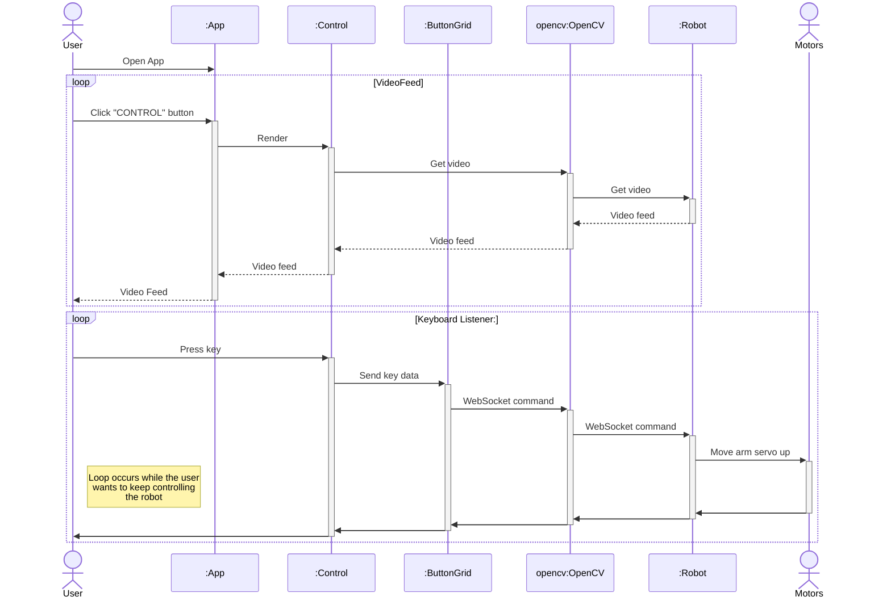

```mermaid
sequenceDiagram
    actor U as User
    participant App as :App
    participant C as :Control
    participant BG as :ButtonGrid
    participant CV as opencv:OpenCV
    participant R as :Robot
    actor M as Motors

    U->>App: Open App

    loop VideoFeed
        U->>+App: Click "CONTROL" button
        App->>+C: Render
        C->>+CV: Get video
        CV->>+R: Get video
        R-->>-CV: Video feed
        CV-->>-C: Video feed
        C-->>-App: Video feed
        App-->>-U: Video Feed
    end

    loop Keyboard Listener:
        U->>+C: Press key
        C->>+BG: Send key data
        BG->>+CV: WebSocket command
        CV->>+R: WebSocket command
        R->>+M: Move arm servo up
        Note right of U: Loop occurs while the user<br/>wants to keep controlling<br/>the robot
        M->>-R: 
        R->>-CV: 
        CV->>-BG: 
        BG->>-C: 
        C->>-U: 
    end
```