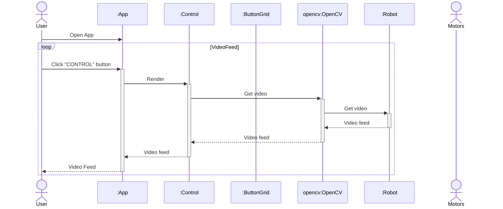
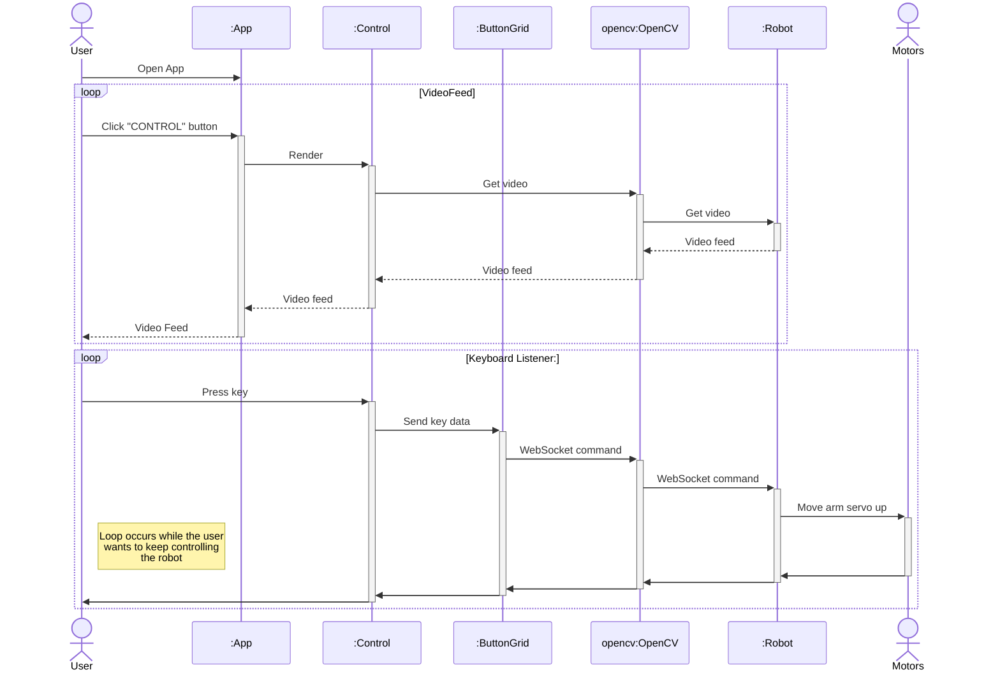
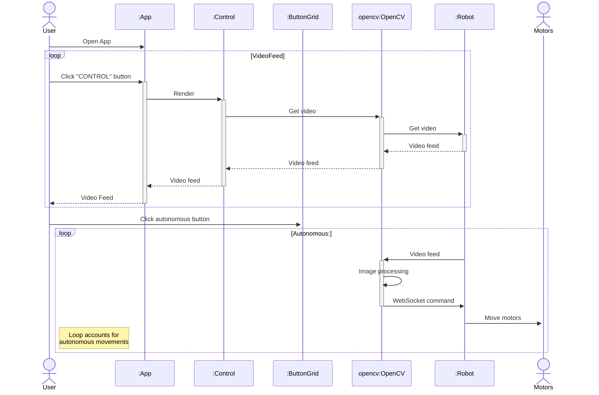

# Sequence Diagrams
## Use Case #1
As a user, I want to be able to look for objects using the RoboControl’s camera. 

1.	The user powers on the RoboControl device. 
2.	The user navigates to the control website. 
3.	The user views the live camera feed on his/her device. 
4.	The user exits the website and powers down the RoboControl device. 

## Use Case #2
As a user, I want to be able to control the robot so it is able to traverse through a custom obstacle course for entertainment.

1. The user powers on the RoboControl device. 
2. The user places the RoboControl in the desired starting position. 
3. The user navigates to the control website. 
4. The user uses the GUI with all the controls and maneuvers the robot through the course. 
5. The user exits the website and powers down the RoboControl device. 

## Use Case #3
As a user, I want the RoboControl to autonomously center and manuever through a track defined by painter’s tape. 

1. The user powers on the RoboControl device. 
2. The user places the RoboControl in the desired starting position. 
3. The user navigates to the control website and enables ‘Autonomous Mode’. 
4. The RoboControl will automatically center and traverse through the course using computer vision. 
5. At the end of the course, the user disables ‘Autonomous Mode’, exits the website, and powers down the RoboControl device. 

## Use Case #4 
As a user, I want to control the robot while on vacation to confirm security measures are taken

1. The user powers on the RoboControl device before leaving. 
2. The user, while on vacation, goes to ryanhodge.net
3. The user enters a password to gain control of the robot
4. The user begins to navigate the robot around the apartment
5. The user raises and lowers the robot's camera to confirm that doors are not left ajar and lights are not on

## Use Case #5
As a user, I want to use a RoboControl to make a map of the surrounding area. 

1. The user powers on the RoboControl device. 
2. The user places the RoboControl in the desired starting position. 
3. The user navigates to the control website. 
4. The user views the live camera feed on his/her device. 
5. The user controls the robot to go to the desired area
6. The user manually edits his/her map based on the landmarks discovered by the robot’s camera.
7. The user controls the robot arm to leave new landmarks.  
8. The user exits the website and powers down the RoboControl device.

