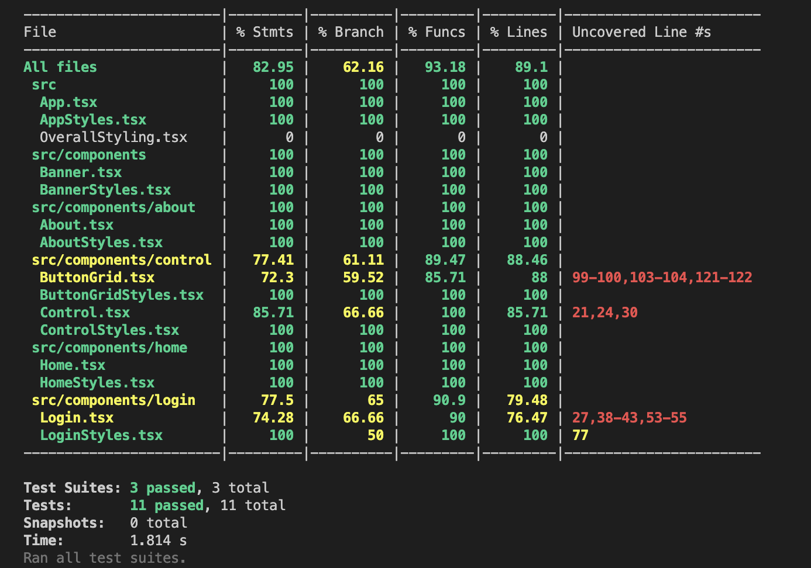
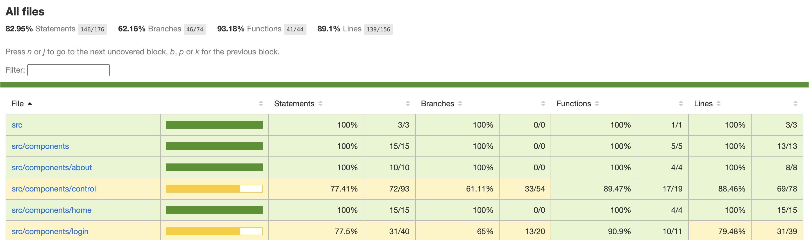
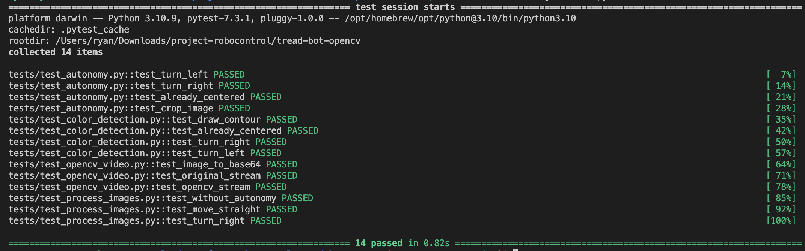
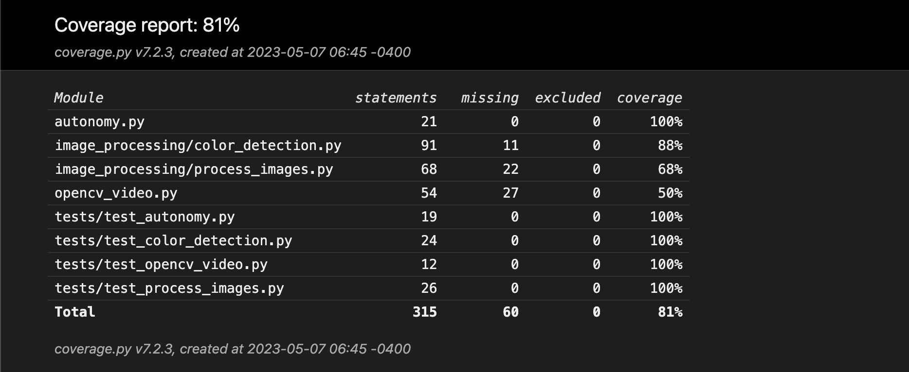

# Unit tests

## Testing Procedure

### Website

- App.test.tsx
  - Render whole app
    - Test: Render the entire application to confirm that it can be rendered properly and there are no initial rendering issues
      - Confirm that the buttons were rendered in the assertion
    - Input: None
    - Result: The app is rendered in the background and the buttons have been rendered
  - Open control page
    - Test: Click on the control button on the home page to render the control page. Assert that the window path has changed to include the control subtext
    - Input: A user click on the button labeled "CONTROL"
    - Result: The window location ends with '/control'
  - Open about page
    - Test: Use the hamburger menu to navigate back to the home screen. Then, from the home screen, click on the button labeled "ABOUT" to render the about page
    - Input: A user click on the hamburger icon, a user click on the HOME button on the hamburger menu, and then a user click on the ABOUT button on the home page.
    - Result: The window location ends with '/about'
  - Navigate to controls page from offcanvas
    - Test: use the offcanvas (Hamburger) menu to navigate to the control page from any page.
    - Input: A user click on the hamburger icon, then another on the CONTROL button on the offcanvas menu
    - Result: The window location ends with '/control'
  - Navigate to about page from offcanvas
    - Test: use the offcanvas (Hamburger) menu to navigate to the about page from any page.
    - Input: A user click on the hamburger icon, then another on the ABOUT button on the offcanvas menu
    - Result: The window location ends with '/about'
  - Navigate back to home page from offcanvas
    - Test: use the offcanvas (Hamburger) menu to navigate to the home page from any page.
    - Input: A user click on the hamburger icon, then another on the CONTROL button on the offcanvas menu, then a user click on the hamburger icon, then another on the HOME button on the offcanvas menu
    - Result: The window location ends with '/home'
- Control.test.tsx
  - Render control page
    - Test: Confirm that the controls page is rendering properly without issue by asserting that the test id "Control" exists on the page
    - Input: None
    - Result: The control page has rendered on the test website
  - Try to login
    - Test: That logging in works properly when mocking the server
    - Input: User typing "ryan" into the username section of the login, user typing "ryan" into the password section of the login, the user clicking the "Login" button.
    - Result: The user is able to properly login to the button grid controls and control the robot
- ButtonGrid.test.tsx
  - Render button grid
    - Test: The button grid component is rendered with dummy data to confirm the components baseline functionality
    - Input: None
    - Result: The ButtonGrid component is indexed by its test ID and is confirmed to exist
  - Move robot with key-presses
    - Test: Confirm the functionality of the arrow keys sending messages to the robot over websockets
    - Input: Mocked keystrokes are used as inputs by rerendering the ButtonGrid component similarly to how Control would rerender the ButtonGrid on keystroke inputs
    - Result: The ButtonGrid component is rerendered each time a new key is being tested, and the corresponding button is checked to see if its styling includes the correct color.
  - Autonomous button
    - Test: Confirm functionality of the autonomous button by clicking it
    - Input: User clicks on the button labeled "AUTONOMOUS"
    - Result: The button turns green when in autonomous mode, hence a green color is checked for in the styling of the button component to confirm autonomous mode has occurred.

### OpenCV Server

- test_autonomy
  - test_turn_left
    - Test: Given a left turning direction, confirm that the output command of center_robot gives the correct dictionary object
    - Input: A string 'left'
    - Result: The output of center_robot will return a dictionary including a turn property which will be set equal to 'left'
  - test_turn_right
    - Test: Given a right turning direction, confirm that the output command of center_robot gives the correct dictionary object
    - Input: A string 'right'
    - Result: The output of center_robot will return a dictionary including a turn property which will be set equal to 'right'
  - test_already_centered
    - Test: Given no turning direction, confirm that the output command of center_robot gives the correct dictionary object
    - Input: A string 'stop'
    - Result: The output of center_robot will return a dictionary including a turn property which will be set equal to 'no'
  - test_crop_image
    - Test: Crop a given image to a given height
    - Input: A small black image, a minimum height to crop at, and a maximum height to crop at
    - Result: Confirm that the cropped image is the expected heigh of 20 and that the width has not changed of the original image
- test_color_detection
  - test_draw_contour
    - Test: Given an image and a contour, confirm that a contour is drawn around an image using the draw_contour function
    - Input: A small black image, a constant defined contour
    - Result: The original image has been changed and a contour has been drawn on it. Testing the (0, 0) pixel to confirm that it has changed from black to a different color
  - test_already_centered
    - Test: Confirm that, when the robot detects a straight path, it will not try to send a turning command to the robot
    - Input: An image of two detectable lines separated and centered horizontally.
    - Result: Assert that the robot will not try to turn when given this image
  - test_turn_right
    - Test: Confirm that, when the robot detects a single path on the left of the screen, it will try to send a right turn command
    - Input: An image of one detectable line on the left side of the image
    - Result: Assert that the robot will try to turn right in this scenario
  - test_turn_left
    - Test: Confirm that, when the robot detects a single path on the right of the screen, it will try to send a left turn command
    - Input: An image of one detectable line on the right side of the image
    - Result: Assert that the robot will try to turn left in this scenario
- test_opencv_video
  - test_image_to_base64
    - Test: Convert an image into base64 encoding
    - Input: A small black image
    - Result: Assert that the output of the cv2_to_base64 function is in bytes
  - test_original_stream
    - Test: Try to run the original stream function
    - Input: None
    - Result: The video stream should start running. Nothing is asserted here
  - test_opencv_stream
    - Test: Try to run the opencv stream function
    - Input: None
    - Result: The video stream should start running. Nothing is asserted here
- test_process_images
  - test_without_autonomy
    - Test: To start, confirm that the function is working without autonomy
    - Input: Autonomous is set to False and four empty queues
    - Result: Confirm that the command queue is still empty
  - test_move_straight
    - Test: Test if the robot will move straight given an image with a straight path
    - Input: Autonomous is set to True and three empty queues. A fourth queue is added with the image already in it
    - Result: Forward is included in the output command and no turn direction as well
  - test_turn_right
    - Test: Confirm that the robot will try to turn the correct direction if given a one line image
    - Input: Three empty queues, one queue with an image containing a path on the left side of the image, and autonomous set to True
    - Result: Confirm that there is no forward movement and there is a right turn in the command sent from the server

## Testing Results
### Website

<em>Figure 1: Website command line report</em>

<em>Figure 2: Website coverage report</em>

The website was able to be tested for 89.1% of its lines of code, with many files showing 100% coverage. Each component of the website was tested individually and confirmed to be functioning properly before moving to the next component. Figure 1 displays the testing coverage report given in the command line when executing the testing command. 

### OpenCV Server

<em>Figure 3: OpenCV server command line report</em>

<em>Figure 4: OpenCV server coverage report</em>

The OpenCV server code was able to be tested for a total of 81% coverage, although some files are missing from the coverage data. The server has a similar problem to the robot code, where most of the code consists of communication which cannot be testing in procedural unit tests, and instead must be tested through manual acceptance criterion and tests. 

### Robot Code
No unit testing was able to be carried out on the robot code since the purpose of this code was to simply take commands from the websockets and convert them into motor movement. The majority of the robot code was manually tested through sending websocket commands manually to the robot and observing the robot's response.